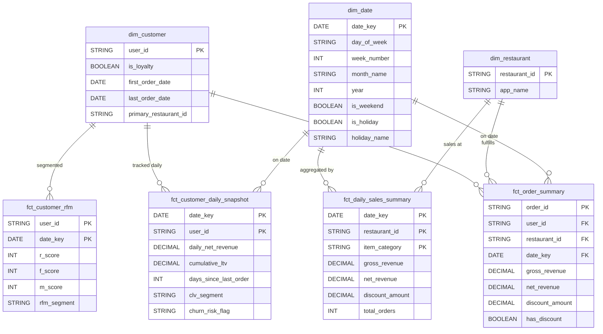

# Global Partners — Data Model Design

This document defines the complete data model for the Global Partners Business Insights project. It is structured using a **Medallion Architecture** (Bronze → Silver → Gold) and designed to satisfy both the **Primary Goal** (daily evolving Customer LTV) and all **Secondary Goals** from Step 5.

---

## Source Tables (SQL Server — as-is)

These are the raw tables already loaded into the `GlobalPartnersDB` RDS instance.

| Source Table | Rows | Description |
|---|---|---|
| `order_items` | 203,519 | Line-item level transaction data |
| `order_item_options` | 193,017 | Add-ons, modifiers, and discounts per line item |
| `date_dim` | 365 | Calendar dimension table |

---

## Bronze Layer (Raw Parquet — 1:1 Copy)

The Bronze layer is a **byte-for-byte copy** of the source tables converted to Parquet. No transformations occur here — this preserves the raw data as an immutable audit trail.

| Bronze Table | Source |
|---|---|
| `bronze_order_items` | `order_items` |
| `bronze_order_item_options` | `order_item_options` |
| `bronze_date_dim` | `date_dim` |

---

## Silver Layer (Cleaned, Typed, Enriched)

The Silver layer applies data quality rules: casting types, standardizing formats, deduplicating, and computing line-level revenue. This is where the data becomes **analytically trustworthy**.

### `silver_order_items`
Cleaned and typed version of `order_items` with computed line-item revenue.

| Column | Type | Notes |
|---|---|---|
| `order_id` | STRING | PK (composite with lineitem_id) |
| `lineitem_id` | STRING | PK (composite with order_id) |
| `app_name` | STRING | Ordering platform |
| `restaurant_id` | STRING | FK → dim_restaurant |
| `order_date` | DATE | Derived: `CAST(creation_time_utc AS DATE)` |
| `order_timestamp` | TIMESTAMP | Cleaned `creation_time_utc` |
| `user_id` | STRING | FK → dim_customer (NULLs filtered or tagged as 'GUEST') |
| `is_loyalty` | BOOLEAN | Loyalty membership flag |
| `currency` | STRING | Transaction currency |
| `item_category` | STRING | Menu category |
| `item_name` | STRING | Item name |
| `item_price` | DECIMAL(10,2) | Unit price |
| `item_quantity` | INT | Quantity purchased |
| `line_item_revenue` | DECIMAL(10,2) | **Computed**: `item_price * item_quantity` |

### `silver_order_item_options`
Cleaned options with computed option-level revenue.

| Column | Type | Notes |
|---|---|---|
| `order_id` | STRING | FK → silver_order_items |
| `lineitem_id` | STRING | FK → silver_order_items |
| `option_group_name` | STRING | Option category (e.g., Size, Toppings) |
| `option_name` | STRING | Selected option |
| `option_price` | DECIMAL(10,2) | Price (negative = discount) |
| `option_quantity` | INT | Number of times applied |
| `option_revenue` | DECIMAL(10,2) | **Computed**: `option_price * option_quantity` |
| `is_discount` | BOOLEAN | **Computed**: `TRUE if option_price < 0` |

### `silver_date_dim`
Cleaned date dimension (minimal changes — primarily type casting).

| Column | Type | Notes |
|---|---|---|
| `date_key` | DATE | Primary key |
| `day_of_week` | STRING | e.g., Monday |
| `week_number` | INT | ISO week |
| `month_name` | STRING | e.g., January |
| `month_number` | INT | **Derived**: for sorting |
| `year` | INT | Calendar year |
| `is_weekend` | BOOLEAN | Weekend flag |
| `is_holiday` | BOOLEAN | Holiday flag |
| `holiday_name` | STRING | Holiday name (nullable) |

---

## Gold Layer (Business-Ready Aggregates)

The Gold layer contains the final, business-facing tables that directly power the Streamlit dashboards and metrics from Step 5. It uses a **star schema** with dimension tables and fact tables.

### Dimension Tables

#### `dim_customer`
One row per customer. Derived from `silver_order_items`.

| Column | Type | Description | Supports Metric |
|---|---|---|---|
| `user_id` | STRING | PK — Unique customer identifier | All |
| `is_loyalty` | BOOLEAN | Most recent loyalty status | #5 Loyalty Impact |
| `first_order_date` | DATE | Earliest order date | #3 Churn |
| `last_order_date` | DATE | Most recent order date | #3 Churn |
| `primary_restaurant_id` | STRING | Most frequently ordered restaurant | #6 Locations |
| `primary_app` | STRING | Most used ordering platform | General |

> [!NOTE]
> `total_orders` and `total_spend` are intentionally **not** stored here. They are computed on-the-fly by joining to `fct_order_summary` at query time. This avoids staleness — the dimension stays clean and the fact table is always the source of truth for transactional aggregates.

#### `dim_restaurant`
One row per restaurant location. Derived from `silver_order_items`.

| Column | Type | Description | Supports Metric |
|---|---|---|---|
| `restaurant_id` | STRING | PK — Unique restaurant identifier | #6 Locations |
| `app_name` | STRING | Associated ordering platform | General |

#### `dim_date`
Passthrough from `silver_date_dim` — the calendar dimension.

---

### Fact Tables

#### `fct_order_summary` — Order-Level Fact (Atomic Grain)
One row per **order**. Aggregates line items and options into a single order-level record. This is the foundational fact table from which all other Gold tables are derived.

| Column | Type | Description | Supports Metric |
|---|---|---|---|
| `order_id` | STRING | PK | All |
| `user_id` | STRING | FK → dim_customer | All |
| `restaurant_id` | STRING | FK → dim_restaurant | #6 Locations |
| `date_key` | DATE | FK → dim_date | #4 Sales Trends |
| `app_name` | STRING | Ordering platform | General |
| `is_loyalty` | BOOLEAN | Loyalty flag at time of order | #5 Loyalty |
| `total_items` | INT | SUM of item quantities | General |
| `gross_revenue` | DECIMAL | SUM of `line_item_revenue` | #1 CLV, #7 Pricing |
| `option_revenue` | DECIMAL | SUM of positive `option_revenue` | #7 Pricing |
| `discount_amount` | DECIMAL | SUM of negative `option_revenue` (absolute) | #7 Pricing |
| `net_revenue` | DECIMAL | `gross_revenue + option_revenue - discount_amount` | #1 CLV |
| `has_discount` | BOOLEAN | TRUE if any discount options exist | #7 Pricing |
| `distinct_categories` | INT | Count of unique item_category values | General |

---

#### `fct_customer_daily_snapshot` — Daily LTV Evolution (PRIMARY GOAL)
One row per **customer per day**. This is the core table that shows how LTV evolves daily. Built using a cross-join of `dim_customer` × `dim_date` (only for dates within each customer's active range), then left-joining daily activity.

| Column | Type | Description | Supports Metric |
|---|---|---|---|
| `date_key` | DATE | PK (composite) — FK → dim_date | Primary |
| `user_id` | STRING | PK (composite) — FK → dim_customer | Primary |
| `is_loyalty` | BOOLEAN | Loyalty status as of this date | #5 Loyalty |
| `daily_order_count` | INT | Orders placed on this specific date (0 if none) | #4 Sales Trends |
| `daily_gross_revenue` | DECIMAL | Revenue earned on this date (0 if none) | #4 Sales Trends |
| `daily_net_revenue` | DECIMAL | Net revenue on this date (0 if none) | #7 Pricing |
| `daily_discount_amount` | DECIMAL | Discounts applied on this date | #7 Pricing |
| `cumulative_order_count` | INT | Running total of orders up to this date | #2 RFM (Frequency) |
| `cumulative_ltv` | DECIMAL | **Running SUM of net_revenue** up to this date | **#1 CLV** |
| `days_since_last_order` | INT | Calendar days since most recent order | #3 Churn |
| `avg_order_gap_days` | DECIMAL | Average days between orders (up to this date) | #3 Churn |
| `clv_segment` | STRING | "High" / "Medium" / "Low" (percentile-based) | #1 CLV |
| `churn_risk_flag` | STRING | "Active" / "At Risk" / "Churned" based on thresholds | #3 Churn |

> [!IMPORTANT]
> **How LTV evolves daily**: The `cumulative_ltv` column uses a PySpark window function:
> ```
> SUM(daily_net_revenue) OVER (PARTITION BY user_id ORDER BY date_key ASC)
> ```
> This produces a monotonically increasing curve per customer. On days with no orders, the value carries forward unchanged, but `days_since_last_order` increments — enabling churn detection.

> [!TIP]
> **CLV Segmentation** is recalculated each `date_key` using `PERCENT_RANK()` over `cumulative_ltv`:
> - **High CLV**: Top 20% (percent_rank >= 0.8)
> - **Medium CLV**: Middle 60% (0.2 <= percent_rank < 0.8)
> - **Low CLV**: Bottom 20% (percent_rank < 0.2)

---

#### `fct_customer_rfm` — RFM Segmentation Snapshot
One row per **customer per date_key**. Composite PK retains daily RFM history for trend analysis.

| Column | Type | Description | Supports Metric |
|---|---|---|---|
| `user_id` | STRING | PK (composite) — FK → dim_customer | #2 RFM |
| `date_key` | DATE | PK (composite) — FK → dim_date | #2 RFM |
| `recency_days` | INT | Days since last purchase | #2 RFM |
| `frequency` | INT | Number of orders in last N months | #2 RFM |
| `monetary` | DECIMAL | Total spend in last N months | #2 RFM |
| `r_score` | INT | 1-5 quintile score for recency | #2 RFM |
| `f_score` | INT | 1-5 quintile score for frequency | #2 RFM |
| `m_score` | INT | 1-5 quintile score for monetary | #2 RFM |
| `rfm_segment` | STRING | "VIP" / "New Customer" / "Churn Risk" / "Regular" | #2 RFM |

**Segment Rules:**
- **VIP**: R >= 4 AND F >= 4 AND M >= 4
- **New Customer**: F <= 2 AND R >= 4
- **Churn Risk**: R <= 2 AND F <= 2
- **Regular**: Everything else

---

#### `fct_daily_sales_summary` — Sales Trends
One row per **date × restaurant × item_category**. Powers the Sales Trends dashboard.

| Column | Type | Description | Supports Metric |
|---|---|---|---|
| `date_key` | DATE | FK → dim_date | #4 Sales Trends |
| `restaurant_id` | STRING | FK → dim_restaurant | #6 Locations |
| `item_category` | STRING | Menu category | #4 Sales Trends |
| `total_orders` | INT | Distinct order count | #4, #6 |
| `total_items_sold` | INT | SUM of item quantities | #4 |
| `gross_revenue` | DECIMAL | SUM of line_item_revenue | #4, #6 |
| `net_revenue` | DECIMAL | Gross + options - discounts | #4, #6 |
| `discount_amount` | DECIMAL | Total discounts applied | #7 Pricing |
| `discounted_order_count` | INT | Orders with at least one discount | #7 Pricing |
| `non_discounted_order_count` | INT | Orders without any discounts | #7 Pricing |
| `avg_order_value` | DECIMAL | net_revenue / total_orders | #6 Locations |

---

## Entity Relationship Diagram



---

## Metrics Traceability Matrix

This matrix maps every Step 5 metric to its Gold-layer table, confirming complete coverage.

| # | Metric | Primary Gold Table | Key Columns |
|---|---|---|---|
| 1 | **Customer Lifetime Value** | `fct_customer_daily_snapshot` | `cumulative_ltv`, `clv_segment` |
| 2 | **Customer Segmentation (RFM)** | `fct_customer_rfm` | `r_score`, `f_score`, `m_score`, `rfm_segment` |
| 3 | **Churn Indicators** | `fct_customer_daily_snapshot` | `days_since_last_order`, `avg_order_gap_days`, `churn_risk_flag` |
| 4 | **Sales Trends Monitoring** | `fct_daily_sales_summary` | `gross_revenue`, `net_revenue` by date/location/category |
| 5 | **Loyalty Program Impact** | `fct_order_summary` + `dim_customer` | `is_loyalty`, `net_revenue`, `total_orders` |
| 6 | **Top-Performing Locations** | `fct_daily_sales_summary` | `restaurant_id`, `net_revenue`, `avg_order_value` |
| 7 | **Pricing and Discount Effectiveness** | `fct_daily_sales_summary` + `fct_order_summary` | `discount_amount`, `has_discount`, `discounted_order_count` |

---

## Design Decisions and Rationale

1. **Daily Snapshot pattern for LTV**: Rather than storing only a current-state aggregate, we use a periodic snapshot fact. This lets the dashboard show a time-series chart of each customer's LTV growth curve — which is the primary requirement.

2. **Separate RFM table**: RFM scores involve windowed percentile calculations that are computationally distinct from LTV. Keeping them in a dedicated table avoids bloating the daily snapshot and keeps the PySpark jobs modular.

3. **Order-level fact table**: `fct_order_summary` serves as the "atomic" grain fact that pre-aggregates line items and options into a single order record. All other Gold tables derive from this, ensuring consistency.

4. **Star schema over snowflake**: Fewer joins = faster dashboard queries. The dimensions are small enough (28 restaurants, ~20k customers, 365 dates) that denormalization has negligible storage cost.
