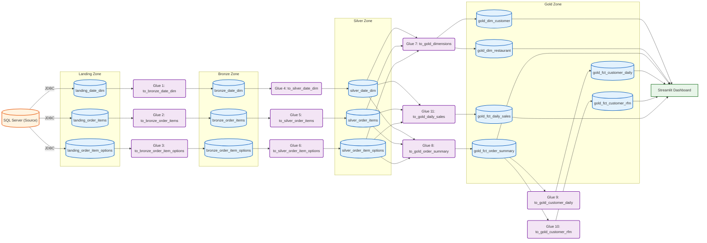

# Global Partners: Full Implementation Plan

This is the complete, end-to-end plan for the Business Insights Assessment project. It maps directly to the 7 steps in the [requirements document](file:///c:/Workspace/GitRepos/global_partners_project/docs/requirements_text.txt) and incorporates all coach feedback received so far.

---

## Current Progress

| Step | Description | Status |
|------|------------|--------|
| 1 | Source Data Setup (CSV → RDS SQL Server) | ✅ Done |
| 2 | Initial Data Analysis | ✅ Done |
| 3 | Architecture + Data Model Design | ✅ Approved by coach |
| 4 | Build the Data Pipeline (PySpark) | ⬜ Not started |
| 5 | Define & Calculate Metrics | ⬜ Not started |
| 6 | Build Streamlit Dashboard | ⬜ Not started |
| 7 | Submission (CI/CD, docs, video) | ⬜ Not started |

---

## Step 2: Initial Data Analysis (Complete)

| Source Table | Rows | Key Observations |
|---|---|---|
| `date_dim` | 365 | Clean calendar dimension. 365 unique dates. `holiday_name` naturally null on non-holidays. |
| `order_items` | 203,519 | 131K unique orders, 20K unique users, 28 restaurants. `user_id` has ~2K nulls (guest checkouts). `printed_card_number` mostly null (loyalty card). |
| `order_item_options` | 193,017 | Clean child table of `order_items`. Negative `option_price` = discounts. |

**Key Join Paths:**
- `order_items` ↔ `order_item_options` via (`order_id`, `lineitem_id`)
- `order_items` ↔ `date_dim` via `CAST(creation_time_utc AS DATE)` = `date_key`

---

## Step 3: Architecture Design

### Constraints (from requirements)
- Source = SQL Server (on-prem simulation via RDS)
- AWS resources only — no Snowflake, no dbt, no external tools
- All transformation logic in **PySpark**
- Pipeline scheduled **once daily** as a batch process
- Must include: scheduling, encryption, failure/reload mechanism

### Simplified Architecture Diagram



### Why Each AWS Service?

| Service | Role | Why We Need It |
|---|---|---|
| **AWS Glue (Jobs)** | Runs PySpark transformation scripts | Serverless Spark — no cluster management. Each table gets its own job for isolation. |
| **AWS Glue (Workflows)** | Scheduling + orchestration | Handles both the daily cron schedule AND job chaining (Bronze → Silver → Gold) in one place. Replaces the need for EventBridge + Step Functions. |
| **Amazon S3** | Stores data at every Medallion layer (Parquet) | Cheap, durable, fast. Parquet format = columnar + compressed. |
| **CloudWatch** | Logging and SLA monitoring | Captures all Glue job logs. Alarms if pipeline exceeds time limit. |
| **KMS (SSE-KMS)** | Encryption at rest for **all 4** S3 layers (Landing, Bronze, Silver, Gold) | Requirement: data encryption. Every bucket uses SSE-KMS — no layer is left unencrypted. |

> [!NOTE]
> **Why Glue Workflows instead of EventBridge + Step Functions?** Our pipeline is a straightforward linear chain of Glue jobs — exactly what Glue Workflows was designed for. Using EventBridge + Step Functions would add unnecessary complexity (extra IAM roles, separate JSON configs, more services to monitor) with no benefit for this use case. Glue Workflows provides scheduling, dependency management, and retry handling all within a single service.

### Failure & Reload Mechanism (Idempotency)
- All PySpark writes use **partition-based overwrites** with a standardized partition key: `write.mode("overwrite").partitionBy("date_key")`. All Gold fact tables use `date_key` as their partition key — matching the `dim_date` PK — for consistency.
- Glue Workflows has **built-in retry configuration** per job for transient failures.
- To reload: re-trigger the Glue Workflow for a specific `date_key`. The overwrite mode naturally repairs data without duplicates.

---

## Step 4: Build the Pipeline — Phased Approach

### Phase A: Local Development (What we build first)

> [!IMPORTANT]
> Industry standard: Write and debug PySpark scripts locally before deploying to AWS Glue. This avoids paying for Glue spin-up time during development.

We will create 11 standalone PySpark scripts inside `src/pyspark_jobs/`. Each script reads from the previous layer (starting from RDS) and writes local Parquet output to `data/output/<layer>/`.

#### Project Structure After Phase A

```
global_partners_project/
├── docs/
│   ├── source_data/               # Raw CSVs
│   ├── GlobalPartners_Requirements.pdf
│   ├── implementation_plan.md     # This document
│   └── data_model.md             # Star schema & table specs
├── src/
│   └── pyspark_jobs/
│       ├── config.py              # Shared RDS connection + S3 path config
│       ├── landing_to_bronze/
│       │   ├── to_bronze_date_dim.py
│       │   ├── to_bronze_order_items.py
│       │   └── to_bronze_order_item_options.py
│       ├── bronze_to_silver/
│       │   ├── to_silver_date_dim.py
│       │   ├── to_silver_order_items.py
│       │   └── to_silver_order_item_options.py
│       └── silver_to_gold/
│           ├── to_gold_dimensions.py
│           ├── to_gold_order_summary.py
│           ├── to_gold_customer_daily.py
│           ├── to_gold_customer_rfm.py
│           └── to_gold_daily_sales.py
├── data/
│   └── output/                    # Local Parquet outputs for testing
│       ├── bronze/
│       ├── silver/
│       └── gold/
├── streamlit_app/
│   └── app.py
├── upload_to_rds.py
└── requirements.txt
```

#### What Each Script Does

**Landing → Bronze (Jobs 1–3):** Read raw tables from RDS via JDBC. Write as-is to Parquet. Add `ingestion_timestamp` metadata column.

**Bronze → Silver (Jobs 4–6):**

| Script | Key Transformations |
|---|---|
| `to_silver_date_dim` | Cast `date_key` to DATE, `is_weekend`/`is_holiday` to BOOLEAN, derive `month_number` for sorting |
| `to_silver_order_items` | Cast `creation_time_utc` to TIMESTAMP, derive `order_date` (DATE), cast prices to DECIMAL, compute `line_item_revenue = item_price × item_quantity`, tag null `user_id` as `'GUEST'` |
| `to_silver_order_item_options` | Cast prices to DECIMAL, compute `option_revenue = option_price × option_quantity`, derive `is_discount = option_price < 0` |

**Silver → Gold (Jobs 7–11):**

| Script | Output Table(s) | Logic |
|---|---|---|
| `to_gold_dimensions` | `dim_customer`, `dim_restaurant` | Derive from `silver_order_items`: first/last order dates, primary restaurant, loyalty status. **Note:** `total_orders` and `total_spend` are NOT stored here — they are computed on-the-fly by joining to `fct_order_summary` at query time to avoid staleness. |
| `to_gold_order_summary` | `fct_order_summary` | Roll up line items + options to one row per order. Compute `gross_revenue`, `option_revenue`, `discount_amount`, `net_revenue` |
| `to_gold_customer_daily` | `fct_customer_daily_snapshot` | Cross-join customers × dates in their active range. Running `cumulative_ltv` via window function. Derive `clv_segment` (percentile) and `churn_risk_flag` (inactivity threshold) |
| `to_gold_customer_rfm` | `fct_customer_rfm` | Recency/Frequency/Monetary scores (1–5 quintiles). Segment labels: VIP, New, Churn Risk, Regular. **PK is composite (`user_id`, `date_key`)** to retain daily RFM history for trend analysis. |
| `to_gold_daily_sales` | `fct_daily_sales_summary` | Aggregate by date × restaurant × category. Compute revenue, discounts, order counts, avg order value |

### Phase B: AWS Deployment (After local validation)

Once local Parquet outputs are verified correct:
1. Wrap each `.py` script as an AWS Glue Job (minimal changes — swap local paths for S3 paths)
2. Create a **Glue Workflow** with triggers to chain the 11 jobs (Bronze → Silver → Gold)
3. Add a **scheduled trigger** on the Workflow for daily execution (cron)
4. Configure S3 bucket encryption (SSE-KMS)

---

## Step 5: Metrics Coverage

All 7 required metrics are fully traceable to Gold-layer tables:

| # | Metric | Gold Table | Key Columns |
|---|---|---|---|
| 1 | **Customer Lifetime Value (CLV)** — *Primary* | `fct_customer_daily_snapshot` | `cumulative_ltv`, `clv_segment` |
| 2 | **Customer Segmentation (RFM)** | `fct_customer_rfm` | `r_score`, `f_score`, `m_score`, `rfm_segment` |
| 3 | **Churn Indicators** | `fct_customer_daily_snapshot` | `days_since_last_order`, `avg_order_gap_days`, `churn_risk_flag` |
| 4 | **Sales Trends Monitoring** | `fct_daily_sales_summary` | revenue by date/location/category |
| 5 | **Loyalty Program Impact** | `fct_order_summary` + `dim_customer` | `is_loyalty`, `net_revenue`, `total_orders` |
| 6 | **Top-Performing Locations** | `fct_daily_sales_summary` | `restaurant_id`, `net_revenue`, `avg_order_value` |
| 7 | **Pricing & Discount Effectiveness** | `fct_daily_sales_summary` + `fct_order_summary` | `discount_amount`, `has_discount`, discounted vs non-discounted counts |

---

## Step 6: Streamlit Dashboard

6 dashboard tabs mapping directly to the business questions from the requirements:

| Tab | Business Question | Primary Visualization |
|---|---|---|
| **1. Customer LTV** | How does LTV evolve daily per customer? | Time-series line chart of cumulative LTV by CLV segment |
| **2. Customer Segmentation** | What segments emerge from RFM analysis? | 3D scatter (R,F,M) + segment breakdown pie/bar chart |
| **3. Churn Risk** | Which customers are at risk of churning? | Heatmap of inactivity, filterable table of at-risk customers |
| **4. Sales Trends** | What are monthly/seasonal sales patterns? | Line charts by month, holiday spikes, breakdown by category |
| **5. Loyalty Impact** | How does loyalty affect spend & retention? | Side-by-side bar charts: loyalty vs non-loyalty (AOV, CLV, repeat rate) |
| **6. Location Performance** | Which locations are best/worst? | Ranked bar chart, revenue map, avg order value comparison |

> [!TIP]
> The dashboard will read directly from the local Gold-layer Parquet files during development. In production, it connects to S3/Athena.

---

## Step 7: Submission & CI/CD

### Deliverables Checklist
- [ ] Pipeline documentation (this plan + data model doc)
- [ ] All PySpark ETL scripts (`src/pyspark_jobs/`)
- [ ] AWS configuration (Glue Workflow definition with triggers)
- [ ] Streamlit dashboard (`streamlit_app/app.py`)
- [ ] CI/CD pipeline via GitHub Actions
- [ ] Short video/presentation explaining the work and the "WHY" behind each tech choice

### CI/CD Pipeline (GitHub Actions)
```yaml
# .github/workflows/pipeline.yml
# On push to main:
#   1. Lint PySpark scripts (flake8)
#   2. Run unit tests on transformation logic
#   3. Build & push Streamlit Docker image (optional)
```

---

## Execution Order (Approved)

| Phase | What We Build | Estimated Effort |
|---|---|---|
| **A1** | PySpark: Landing → Bronze (3 scripts) | Light — mostly read/write |
| **A2** | PySpark: Bronze → Silver (3 scripts) | Medium — DQ checks, type casting, computed columns |
| **A3** | PySpark: Silver → Gold (5 scripts) | Heavy — joins, window functions, RFM scoring |
| **A4** | Local validation — run all 11 scripts end-to-end | Verify Parquet outputs |
| **B1** | Streamlit dashboard (6 tabs) | Medium — reads from local Gold Parquet |
| **B2** | AWS deployment (Glue Jobs + Workflow, S3) | Medium — wrap local scripts |
| **B3** | CI/CD + documentation + video | Light |

> [!NOTE]
> **Why dashboard before AWS?** The Streamlit app reads from Parquet files via a configurable path in `config.py`. During local dev it points to `data/output/gold/`. After AWS deployment, we change that single path to `s3://bucket/gold/`. No dashboard code is recreated — just a config swap.

---

## Approved Decisions

1. ✅ **11 Glue jobs** — one per table, including 5 for Gold layer
2. ✅ **Local-first development** — test PySpark locally, then deploy to AWS
3. ✅ **6 dashboard tabs** — covering all 7 metrics (may be revisited later)
4. ✅ **Execution order** — Pipeline (A1–A4) → Dashboard (B1) → AWS (B2) → CI/CD (B3)

## Verification Plan

### Automated
- Run each PySpark script locally and validate row counts match expectations
- Verify Gold-layer metric math by spot-checking against raw SQL queries on RDS
- Confirm all 7 metrics from Step 5 are present and correct in Gold Parquet output

### Manual
- Visual review of Streamlit dashboard tabs with you
- Coach review of final architecture + dashboard before submission
